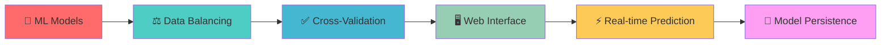
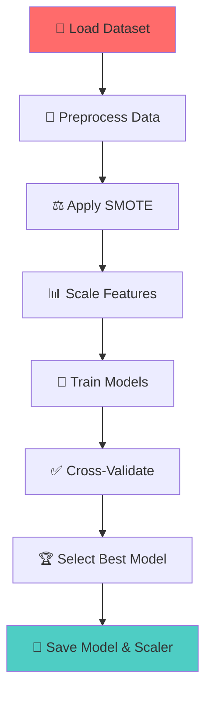
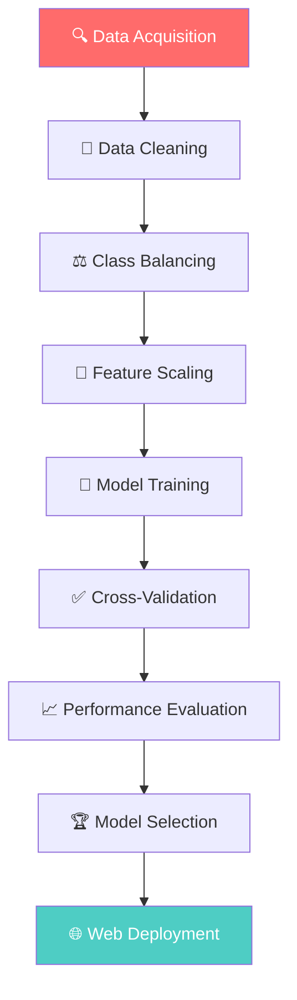
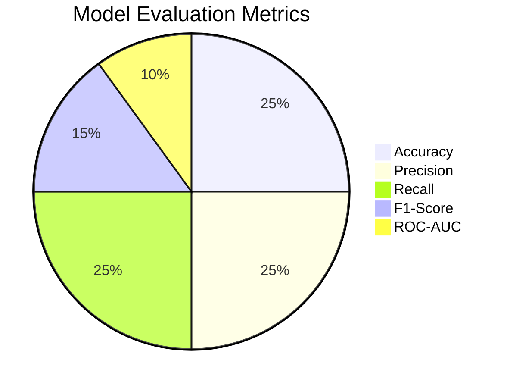
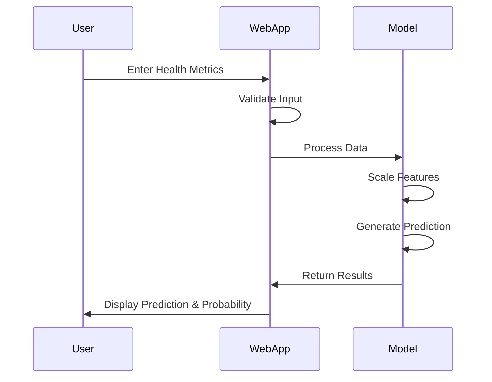

# 🩺 Diabetes Prediction in Females (P_D_F)

<div align="center">


**🎯 Intelligent Healthcare Risk Assessment System**

*A cutting-edge machine learning solution for early diabetes detection using advanced predictive analytics*


</div>

---

## 🏥 Project Overview

This innovative machine learning project revolutionizes diabetes risk assessment by combining **state-of-the-art algorithms** with an intuitive web interface. Our system processes comprehensive health metrics to deliver accurate, real-time diabetes predictions with confidence intervals.

<div align="center">

| **Author** | **SAP ID** | **Batch** | **Roll No** |
|:----------:|:----------:|:---------:|:-----------:|
| Yashika Garg | 500119489 | 12 | R2142230357 |

</div>

---

## 🎯 Strategic Objectives

<div align="center">

| 🎪 **Objective** | 📊 **Description** |
|:-----------------|:-------------------|
| 🔬 **Model Excellence** | Develop high-precision diabetes prediction using balanced datasets and optimal feature scaling |
| ⚡ **Algorithm Optimization** | Compare and select superior ML algorithms through rigorous cross-validation |
| 🚀 **Real-Time Intelligence** | Enable instant predictions through seamless user interaction |
| 🌐 **Healthcare Deployment** | Create scalable tools supporting early diabetes detection in clinical settings |

</div>

---

## ✨ Key Features

<div align="center">



</div>

### 🔥 Advanced Capabilities

| Feature | Technology | Benefit |
|:--------|:-----------|:--------|
| 🤖 **Multi-Algorithm Comparison** | Logistic Regression, Random Forest, SVM, KNN | Superior model selection |
| ⚖️ **Smart Data Balancing** | SMOTE Implementation | Handles class imbalance effectively |
| 🔄 **Robust Validation** | 5-fold Cross-Validation | Ensures model reliability |
| 🎨 **Modern UI/UX** | Responsive Flask Interface | Professional user experience |
| ⚡ **Instant Analytics** | Real-time Risk Assessment | Immediate healthcare insights |
| 💾 **Production Ready** | Serialized Model Storage | Easy deployment & scaling |

---

## 📊 Dataset Intelligence

<div align="center">


</div>

### 🔬 Data Architecture

```
📂 Data Pipeline
├── 🌐 Source: Plotly GitHub Repository (diabetes.csv)
├── 📈 Features: 8 Critical Health Metrics
│   ├── 🤱 Pregnancies
│   ├── 🍬 Glucose Level
│   ├── 💓 Blood Pressure
│   ├── 📏 Skin Thickness
│   ├── 💉 Insulin Level
│   ├── ⚖️ BMI
│   ├── 🧬 Diabetes Pedigree Function
│   └── 🎂 Age
├── 🎯 Target: Binary (0: Healthy | 1: Diabetes)
└── 🔄 Processing: Advanced SMOTE + StandardScaler
```

---

## 🛠️ Technology Ecosystem

<div align="center">

### Core Technologies


### Frontend & Styling


</div>

---

## 📁 Project Architecture

<div align="center">

```
🏗️ PROJECT STRUCTURE
│
├── 📓 Diabetes_Check.ipynb          # 🧠 ML Model Development Hub
├── 🌐 app.py                        # 🚀 Production Flask Application  
├── 🔄 tempCodeRunnerFile.py         # 🧪 Alternative Implementation
├── 🤖 diabetes_model.pkl            # 💾 Trained Model (Auto-generated)
├── ⚖️ scaler.pkl                    # 📊 Feature Scaler (Auto-generated)
├── 📋 Yashikagarg_500119489_Final_Assignment.pdf  # 📑 Technical Documentation
└── 📖 README.md                     # 📚 Project Guide (This File)
```

</div>

---

## 🚀 Quick Start Guide

### 🔧 Environment Setup

<div align="center">

**Step 1: Install Dependencies**
```bash
pip install pandas numpy scikit-learn imbalanced-learn flask joblib xgboost
```

</div>

### 🧠 Model Training Pipeline

<div align="center">



</div>

**Training Steps:**
1. 📊 Open `Diabetes_Check.ipynb` in Jupyter/Colab
2. ▶️ Execute all cells sequentially
3. 🏆 System automatically selects best-performing model
4. 💾 Generates `diabetes_model.pkl` and `scaler.pkl`

### 🌐 Web Application Deployment

<div align="center">

**Step 2: Launch Web Interface**
```bash
python app.py
```

**Step 3: Access Application**
```
🌐 Navigate to: http://localhost:5000
```

</div>

---

## 🧪 Advanced Methodology

<div align="center">

### 📊 Data Science Workflow



</div>

### 🔬 Technical Implementation

| **Phase** | **Technique** | **Purpose** |
|:----------|:--------------|:------------|
| 🧹 **Data Preprocessing** | Median Imputation | Handle missing values in critical features |
| ⚖️ **Class Balancing** | SMOTE Algorithm | Address dataset imbalance issues |
| 📊 **Feature Engineering** | StandardScaler | Normalize feature distributions |
| 🤖 **Model Training** | Multiple Algorithms | Compare performance across techniques |
| ✅ **Validation** | 5-Fold Cross-Validation | Ensure robust generalization |
| 📈 **Evaluation** | Multi-Metric Assessment | Comprehensive performance analysis |

### 🏆 Algorithm Comparison Matrix

<div align="center">

| Algorithm | Strengths | Use Case |
|:----------|:----------|:---------|
| 🔵 **Logistic Regression** | Interpretable, Fast | Baseline comparison |
| 🌳 **Random Forest** | Robust, Feature importance | Ensemble learning |
| ⚡ **SVM** | High accuracy, Kernel trick | Non-linear patterns |
| 🎯 **KNN** | Simple, Non-parametric | Local pattern recognition |

</div>

---

## 🖥️ Web Interface Showcase

<div align="center">

### 🎨 UI/UX Features


</div>

### ⭐ Premium Features

| Feature | Description | Benefit |
|:--------|:------------|:--------|
| 🎨 **Modern Design** | Clean, professional interface | Enhanced user experience |
| ✅ **Smart Validation** | Real-time input validation | Error prevention |
| ⚡ **Instant Results** | Immediate prediction display | Quick healthcare insights |
| 🛡️ **Error Handling** | Graceful error management | Robust user experience |
| 📱 **Mobile Ready** | Responsive across devices | Universal accessibility |

---

## 📝 Health Metrics Input

<div align="center">

### 🩺 Required Parameters

| Parameter | Range | Unit | Clinical Significance |
|:----------|:------|:-----|:---------------------|
| 🤱 **Pregnancies** | 0-17 | Count | Reproductive history impact |
| 🍬 **Glucose** | 0-200 | mg/dL | Primary diabetes indicator |
| 💓 **Blood Pressure** | 0-122 | mm Hg | Cardiovascular health |
| 📏 **Skin Thickness** | 0-99 | mm | Body fat distribution |
| 💉 **Insulin** | 0-846 | μU/mL | Pancreatic function |
| ⚖️ **BMI** | 0-67.1 | kg/m² | Body composition |
| 🧬 **Diabetes Pedigree** | 0.08-2.42 | Score | Genetic predisposition |
| 🎂 **Age** | 21-81 | Years | Age-related risk factor |

</div>

---

## 🎯 Performance Analytics

<div align="center">

### 📊 Evaluation Metrics Dashboard



</div>

### 🏆 Performance Highlights

- ✅ **Cross-Validation**: 5-fold validation ensures reliability
- 📈 **Multi-Metric**: Comprehensive performance assessment
- 🎯 **Auto-Selection**: Best algorithm chosen automatically
- 📊 **Probability Output**: Risk percentage with predictions

---

## 🔮 Usage Examples

### 🌐 Web Interface Workflow

<div align="center">



</div>

### 💻 Programmatic Implementation

```python
# 🚀 Advanced Usage Example
import joblib
import numpy as np
from datetime import datetime

# 📂 Load pre-trained components
model = joblib.load('diabetes_model.pkl')
scaler = joblib.load('scaler.pkl')

# 🩺 Patient health profile
patient_data = {
    'pregnancies': 2,
    'glucose': 120,
    'blood_pressure': 70,
    'skin_thickness': 30,
    'insulin': 100,
    'bmi': 25.5,
    'diabetes_pedigree': 0.5,
    'age': 28
}

# 🔄 Data preprocessing
features = list(patient_data.values())
scaled_features = scaler.transform([features])

# 🎯 Generate prediction
prediction = model.predict(scaled_features)[0]
probability = model.predict_proba(scaled_features)[0][1]

# 📊 Clinical report
risk_level = "HIGH" if probability > 0.7 else "MODERATE" if probability > 0.4 else "LOW"
timestamp = datetime.now().strftime("%Y-%m-%d %H:%M:%S")

print(f"""
🏥 DIABETES RISK ASSESSMENT REPORT
════════════════════════════════════
📅 Generated: {timestamp}
🎯 Prediction: {'POSITIVE' if prediction == 1 else 'NEGATIVE'}
📊 Risk Probability: {probability:.1%}
⚠️  Risk Level: {risk_level}
════════════════════════════════════
""")
```

---

## 🤝 Contributing Guidelines

<div align="center">

### 🌟 Join Our Development Community


</div>

### 📋 Contribution Workflow

1. 🍴 **Fork** the repository
2. 🌿 **Create** feature branch (`git checkout -b feature/AmazingFeature`)
3. 💾 **Commit** changes (`git commit -m 'Add AmazingFeature'`)
4. 📤 **Push** to branch (`git push origin feature/AmazingFeature`)
5. 🔄 **Open** Pull Request

### 🎯 Areas for Contribution

- 🧠 Additional ML algorithms
- 🎨 UI/UX enhancements  
- 📊 Advanced visualizations
- 🔒 Security improvements
- 📚 Documentation updates

---

## 📜 License & Compliance

<div align="center">


</div>

**Educational Purpose**: This project is developed for academic learning in the Elements of AIML course. For commercial healthcare applications, please ensure proper medical validation and regulatory compliance.

---

## 🙏 Acknowledgments & Credits

<div align="center">

| 🏆 Category | 📋 Details |
|:------------|:-----------|
| 📊 **Dataset** | Plotly GitHub Repository - Diabetes Dataset |
| 🎓 **Course** | Elements of Artificial Intelligence & Machine Learning |
| 🏛️ **Institution** | Academic Excellence in AI/ML Education |
| 🔬 **Libraries** | scikit-learn, Flask, pandas, numpy ecosystem |
| 🌟 **Inspiration** | Advancing healthcare through intelligent systems |

</div>

---

## 📞 Professional Contact

<div align="center">

### 👨‍💻 Developer Information

**Yashika Garg**  
*AI/ML Specialist & Healthcare Technology Enthusiast*

[](https://github.com/yashika128)
[](https://www.linkedin.com/in/yashika-garg-128b98333/)
[](mailto:yashikagarg638@gmail.com)  
📧 yashikagarg638@gmail.com


| **Attribute** | **Value** |
|:--------------|:----------|
| 🆔 **SAP ID** | 500119489 |
| 📚 **Batch** | 12 |
| 🎫 **Roll No** | R2142230357 |
| 🎯 **Specialization** | Healthcare AI/ML |

</div>

---

<div align="center">

## 🌟 Support This Project

**Found this project valuable?**

[](https://github.com/yashika128)
[](https://github.com/yashika128)
[](https://github.com/yashika128)

---

**"Empowering Healthcare Through Intelligent Technology"**  
*🩺 Making Diabetes Prediction Accessible & Accurate*


</div>
